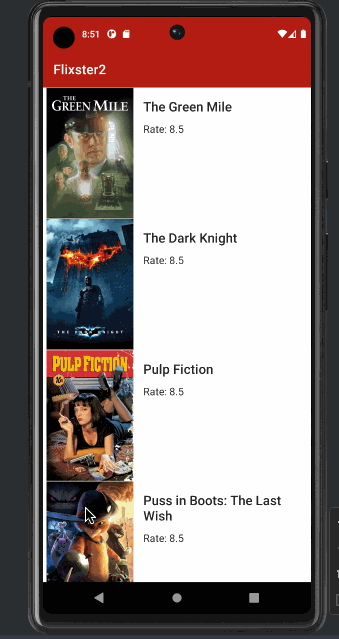

# Android Project 4 - Flixster2

Submitted by: Omar Mohamed

Flixster+ Part 2 is a movie browsing app that allows users to browse ... [TODO]

Time spent: 7 hours spent in total

## Required Features

The following **required** functionality is completed:

- [x] **Choose any endpoint on The MovieDB API except `now_playing`**
  - Chosen Endpoint: `top_rated`
- [x] **Make a request to your chosen endpoint and implement a RecyclerView to display all entries**
- [x] **Use Glide to load and display at least one image per entry**
- [x] **Click on an entry to view specific details about that entry using Intents**

The following **optional** features are implemented:

- [ ] **Add another API call and RecyclerView that lets the user interact with different data.**
- [ ] **Add rounded corners to the images using the Glide transformations**
- [ ] **Implement a shared element transition when user clicks into the details of a movie**

## Video Walkthrough

Here's a walkthrough of implemented user stories:

